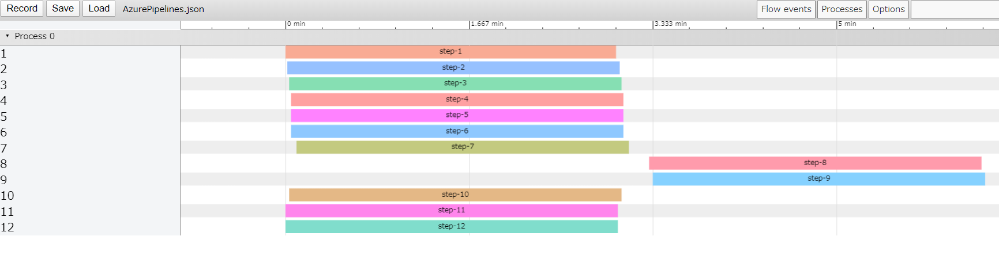

# Ci-Parallel

## CI service parallel capability (FREE/OSS Plan)

|CI|Plan|Limit to|Concurrency Job|Concurrency Step in Job|Parallelism|Max|Note|
|:--|:--|:--|:--|:--|:--|:--|:--|
|[AppVeyor][]|OSS|account|1|-|-|1||
|[Azure Pipelines][]|OSS|project|10|-|-|10 (* Projects)||
|[Bitrise][]|OSS|project|1|-|-|1 (* Projects)|[Starting parallel builds with a single trigger](https://devcenter.bitrise.io/builds/triggering-builds/trigger-multiple-workflows/)|
|[Buddy][]|OSS|account|1|1|-|1||
|[CircleCI](https://circleci.com/pricing/)|FREE|account|30|-|1|1||
|[CircleCI](https://circleci.com/pricing/)|OSS|account|30|-|4|4||
|[Cirrus CI](https://cirrus-ci.org/faq/#are-there-any-limits)|OSS|account|Linux: 8, Windows: 2, FreeBSD: 2, macOS: 1|-|-|13||
|[Codefresh][]|OSS|account|1|2|-|2||
|[CodeShip Pro][]|OSS|project|1|50+|-|50+ (* Projects)|limit nothing?|
|[Drone][]|OSS|limit nothing?|50+|50+|-|50+|limit nothing?|
|[GitHub Actions][]|OSS|[account](https://github.blog/changelog/2019-10-28-github-actions-update-to-job-concurrency-usage-limits/)|20|-|-|20||
|[JFrog Pipelines][]|FREE|nodepool|5|just want|-|just want|[limit to node pool max](https://www.jfrog.com/confluence/display/JFROG/Managing+Pipelines+Node+Pools)|
|[Peakflow][]|FREE|project|1|1|-|1 (* Projects)||
|[Scrutinizer](https://scrutinizer-ci.com/docs/build/running_tests_in_parallel)|OSS|account|1|1|-|1||
|[Semaphore 2.0][]|FREE|organization|1|-|1|1||
|[Semaphore 2.0][]|OSS|organization|4|-|4|4||
|[Travis CI][]|FREE|account|20|-|-|20||
|[wercker][]|OSS|project|2|-|-|2 (* Projects)||

### Concurrency Job

ジョブの並行実行可能数
ここでいうジョブは各 CI サービスが定義するジョブを直接指すものではありません。
ここでのジョブは CI のフロー構成のうちトップレベルの構造を指すものです。

### Concurrency Step in Job

ジョブ中のステップの並行実行可能数。
ここでいうステップは各 CI サービスが定義するステップを直接指すものではありません。
ここでのステップは CI のフロー構成のうち子レベルの構造を指すものです。

### Parallelism

CI サービスの中には特定の処理を複数並列実行させる機能がある場合があります。
（インデックス環境変数が与えられた処理がそれぞれ実行される）
その上限。

### Max

各レベルを合算した場合の並行実行可能数の最大。

## Visualize parallel

1. download json
2. open google chrome
3. open [chrome://tracing](chrome://tracing/)
4. load json

### AppVeyor

[AppVeyor.json](./record/AppVeyor.json)

### Azure Pipelines

[AzurePipelines.json](./record/AzurePipelines.json)

### Bitrise

[Bitrise.json](./record/Bitrise.json)

### CircleCI

[CircleCI.json](./record/CircleCI.json)

### Cirrus CI

[CirrusCI.json](./record/CirrusCI.json)

### Codefresh

[Codefresh.json](./record/Codefresh.json)

### CodeShip

[CodeShip.json](./record/CodeShip.json)

### Drone

[Drone.json](./record/Drone.json)

### GitHub Actions

[GitHubActions.json](./record/GitHubActions.json)

### JFrog Pipelines

[JFrogPipelines.json](./record/JFrogPipelines.json)

### Peakflow

[Peakflow.json](./record/Peakflow.json)

### Scrutinizer

[Scrutinizer.json](./record/Scrutinizer.json)

### Semaphore

[Semaphore.json](./record/Semaphore.json)

### Travis CI

[TravisCI.json](./record/TravisCI.json)

### Wercker

[Wercker.json](./record/Wercker.json)

## Repository for CI service specification survey

* [ci-specs](https://github.com/srz-zumix/ci-specs)

[Appcircle]:https://appcircle.io/
[AppVeyor]:https://www.appveyor.com
[Azure Pipelines]:https://azure.microsoft.com/ja-jp/services/devops/pipelines/
[Bitrise]:https://www.bitrise.io
[Buddy]:https://buddy.works
[CircleCI]:https://circleci.com
[Cirrus CI]:https://cirrus-ci.org/
[Codefresh]:https://codefresh.io/
[Codeship]:https://codeship.com/
[Codeship Basic]:https://codeship.com/
[Codeship Pro]:https://codeship.com/
[Drone]:https://cloud.drone.io/
[GitHub Actions]:https://help.github.com/en/articles/about-github-actions
[JFrog Pipelines]:https://www.jfrog.com/confluence/display/JFROG/JFrog+Pipelines
[Peakflow]:https://www.peakflow.io/
[Razorops]:https://razorops.com/
[Scrutinizer]:https://scrutinizer-ci.com
[Semaphore 2.0]:https://semaphoreci.com/
[Semaphore]:https://semaphoreci.com/
[Travis CI]:https://travis-ci.com/
[wercker]:http://www.wercker.com/
